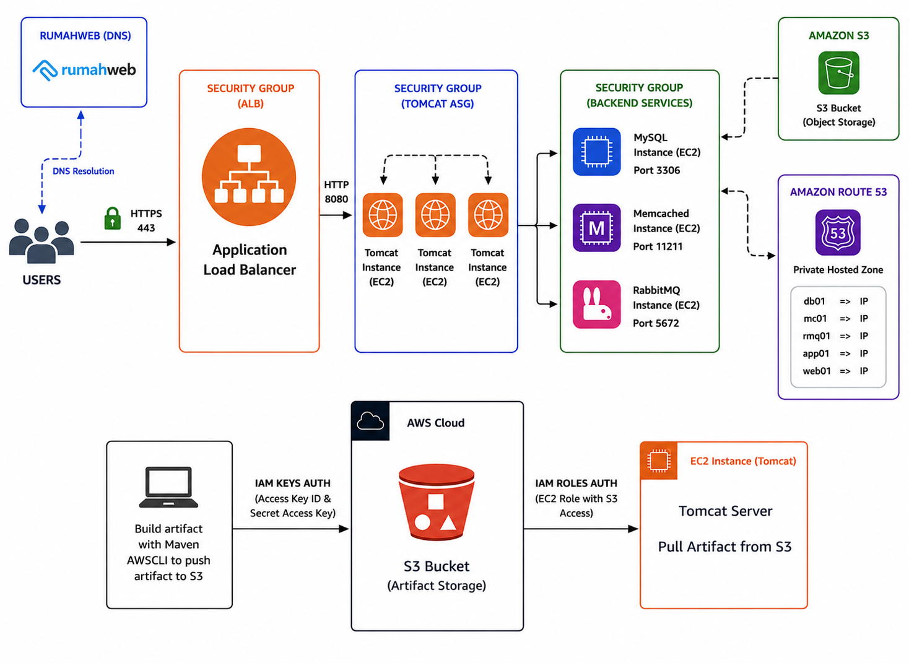
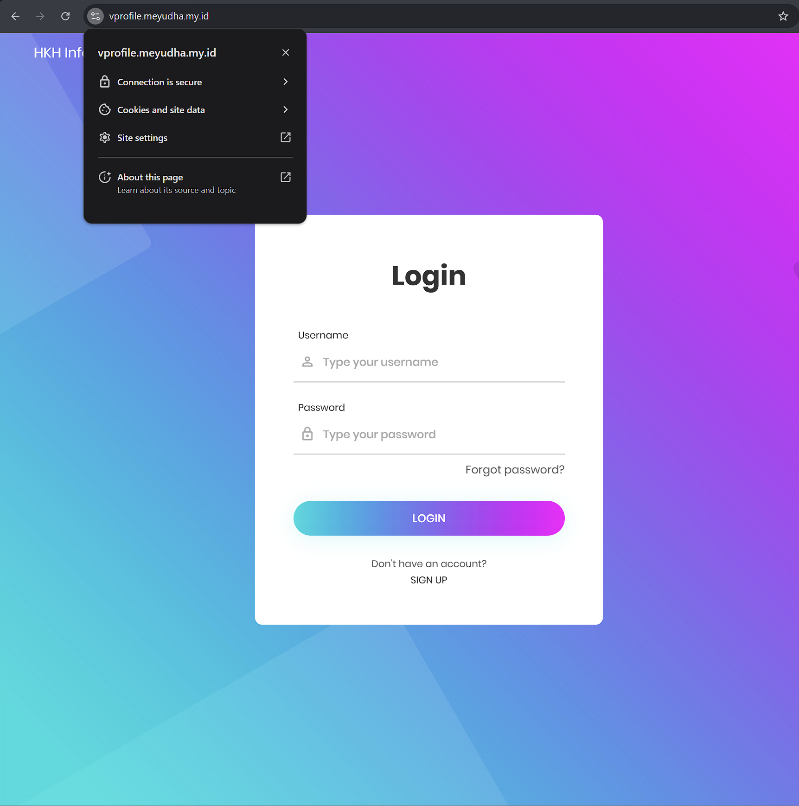
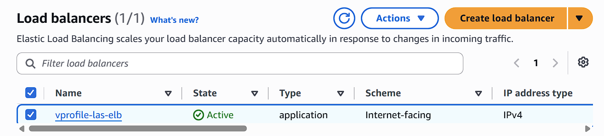
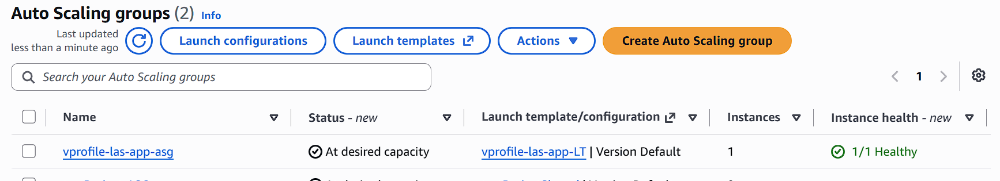
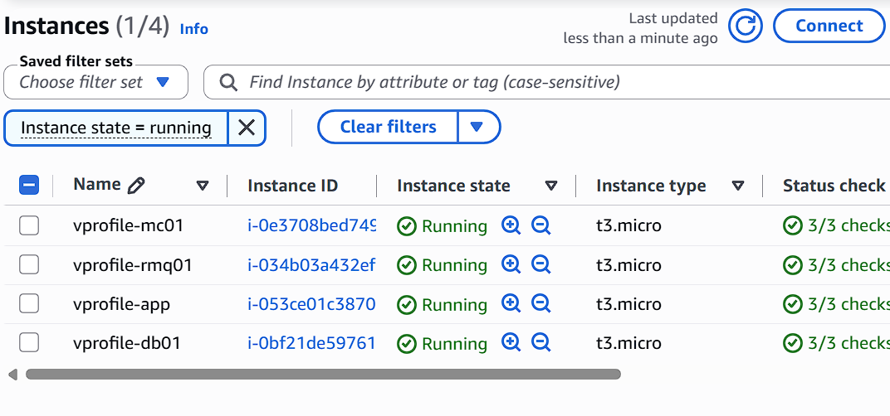

# AWS VProfile Deployment

Deploying the **VProfile** application on AWS using a multi-tier architecture with **Application Load Balancer (ALB)**, **Auto Scaling Group (ASG)**, **Amazon EC2**, **Amazon S3**, **Route 53**, **IAM Roles**, and self-managed backend services.

---

## Architecture

<p align="center">
  
</p>

---

## Project Overview

This project demonstrates how to deploy the VProfile application on AWS using a scalable and secure multi-tier architecture.

The application is deployed on Apache Tomcat running on Amazon EC2 instances behind an Application Load Balancer (ALB). Backend services (MySQL, Memcached, and RabbitMQ) are hosted on dedicated EC2 instances. Application artifacts are stored in Amazon S3, while Route 53 provides DNS resolution and IAM Roles enable secure access to AWS resources.

---

## AWS Services Used

- Application Load Balancer (ALB)
- Auto Scaling Group (ASG)
- Amazon EC2
- Amazon S3
- Amazon Route 53
- IAM Roles
- AWS Certificate Manager (ACM)

---

## Backend Services

- Apache Tomcat
- MySQL
- Memcached
- RabbitMQ
- Maven
- Nginx

---

## Architecture Components

| Component | Purpose |
|----------|----------|
| ALB | Distributes incoming HTTPS traffic |
| Auto Scaling Group | Automatically manages Tomcat instances |
| Amazon EC2 | Hosts the application and backend services |
| MySQL | Database server |
| Memcached | Caching service |
| RabbitMQ | Message broker |
| Amazon S3 | Stores application artifacts |
| Route 53 | DNS management |
| IAM Role | Secure S3 access from EC2 |
| ACM | SSL/TLS certificate |

---

# Deployment Flow

1. Login to AWS Account
2. Create Key Pair
3. Create Security Groups
4. Launch EC2 Instances using User Data scripts
5. Configure Route 53 DNS records
6. Build the application using Maven
7. Upload the artifact to Amazon S3
8. Download the artifact from S3 to the Tomcat EC2 instance
9. Configure Application Load Balancer with HTTPS (AWS Certificate Manager)
10. Map the custom domain to the ALB using Route 53
11. Verify application accessibility
12. Configure Auto Scaling Group for the application

---

## Automation Scripts

| Script | Description |
|---------|-------------|
| backend.sh | Common backend configuration |
| mysql.sh | Install & configure MySQL |
| memcache.sh | Install & configure Memcached |
| rabbitmq.sh | Install & configure RabbitMQ |
| nginx.sh | Install & configure Nginx |
| tomcat_ubuntu.sh | Install Apache Tomcat and deploy the application |

---

# Screenshots

## Architecture


---

## Application



---

## Application Load Balancer



---

## Auto Scaling Group



---

## EC2 Instances



---

## Project Structure

```
aws-vprofile-deployment
│
├── images
│   ├── architecture.png
│   ├── application.png
│   ├── alb.png
│   ├── asg.png
│   └── ec2-instances.png
│
├── scripts
│   ├── backend.sh
│   ├── memcache.sh
│   ├── mysql.sh
│   ├── nginx.sh
│   ├── rabbitmq.sh
│   └── tomcat_ubuntu.sh
│
└── README.md
```

---

## Skills Demonstrated

- AWS EC2
- Application Load Balancer
- Auto Scaling Group
- Amazon S3
- Amazon Route 53
- IAM Roles
- AWS Certificate Manager
- Apache Tomcat
- MySQL
- Memcached
- RabbitMQ
- Nginx
- Linux
- Bash Scripting
- Maven

---

## Learning Outcomes

- Deploying a multi-tier web application on AWS
- Configuring load balancing and auto scaling
- Hosting backend services on Amazon EC2
- Managing DNS with Route 53
- Using IAM Roles for secure AWS resource access
- Securing applications with HTTPS and SSL/TLS
- Automating infrastructure provisioning with Bash scripts

---

## Author

**Yudha Afriza Revi**

Feel free to connect with me on LinkedIn!
